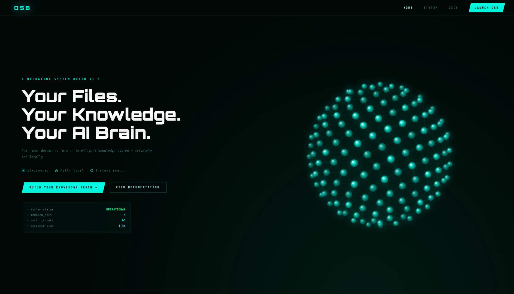
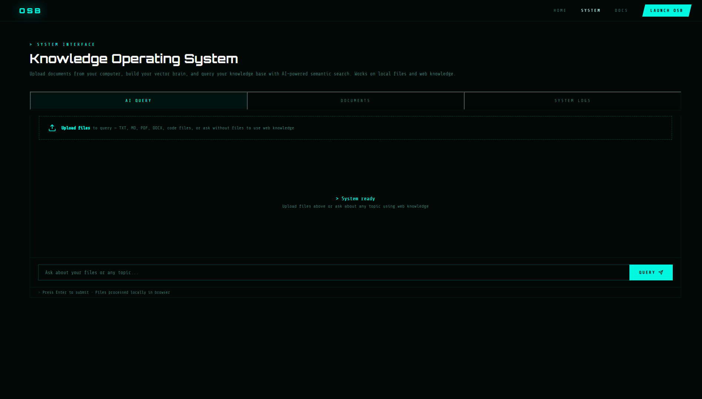
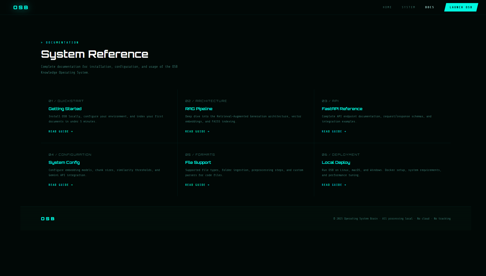

# OSB — Operating System Brain

> **Your Files. Your Knowledge. Your AI Brain.**

Turn your documents into an intelligent, searchable knowledge system — privately and locally. OSB is not a chatbot. It's a knowledge operating system built for developers, researchers, and power users.

🌐 **Live Demo:** [udishgt.github.io/Operating-System-Brain](https://udishgt.github.io/Operating-System-Brain/)

---

## What is OSB?

OSB (Operating System Brain) is a local-first AI knowledge system powered by RAG (Retrieval-Augmented Generation). Upload your documents, build a vector brain, and query your entire knowledge base using natural language — with full source traceability and zero data leakage.

All processing happens **locally on your machine**. No cloud. No tracking. No subscriptions.

---

## Features

- **Semantic Search** — Find information using natural language, not just keywords
- **Source Traceability** — Every answer cites exact document names and chunk references
- **Multi-Format Support** — PDF, DOCX, TXT, MD, Python, JS, JSON, CSV and more
- **Fully Private** — Nothing leaves your machine
- **Terminal-Style UI** — Cyberpunk hacker aesthetic with live system logs
- **Real-time Logs** — Live vector index stats and system monitoring
- **REST API** — Full FastAPI backend with interactive docs at `/docs`

---

## Tech Stack

| Layer | Technology |
|-------|-----------|
| Architecture | RAG (Retrieval-Augmented Generation) |
| Vector DB | FAISS (Facebook AI Similarity Search) |
| Embeddings | all-MiniLM-L6-v2 (384 dimensions) |
| Backend | FastAPI + Python |
| Frontend | HTML, CSS, Vanilla JS |
| File Parsing | PyMuPDF, python-docx |

---

## How It Works

```
User uploads file
      ↓
Text extraction (PDF/DOCX/TXT/code)
      ↓
Chunking (500 chars, 50 overlap)
      ↓
Sentence embedding (all-MiniLM-L6-v2)
      ↓
FAISS vector index storage
      ↓
User asks question
      ↓
Query embedding + cosine similarity search
      ↓
Top-K relevant chunks retrieved
      ↓
LLM generates answer with source citations
```

---
## Screenshots

### Home


### System Interface


### System Logs


## Getting Started

### Prerequisites
- Python 3.10+
- Any LLM API key (Groq free / Anthropic / Gemini)

### Installation

```bash
# Clone the repo
git clone https://github.com/udishgt/Operating-System-Brain.git
cd Operating-System-Brain/backend

# Install dependencies
pip install -r requirements.txt

# Add your API key
cp .env.example .env
# Edit .env and add your key

# Start the backend
python main.py
```

### API Endpoints

| Method | Endpoint | Description |
|--------|----------|-------------|
| POST | `/upload` | Upload and index a document |
| POST | `/query` | Query knowledge base with RAG |
| GET | `/documents` | List all indexed documents |
| DELETE | `/documents/{id}` | Remove a document |
| GET | `/stats` | System stats and metrics |
| GET | `/docs` | Interactive API documentation |

---

## Project Structure

```
Operating-System-Brain/
├── index.html              ← Frontend (live on GitHub Pages)
├── README.md
├── .gitignore
└── backend/
    ├── main.py             ← FastAPI server + all routes
    ├── ingest.py           ← File parsing + chunking pipeline
    ├── embeddings.py       ← FAISS vector store management
    ├── rag.py              ← RAG query pipeline
    ├── requirements.txt
    ├── .env.example        ← API key template
    ├── start.bat           ← Windows one-click start
    └── start.sh            ← Mac/Linux one-click start
```

---

## Roadmap

- [x] Frontend UI with cyberpunk aesthetic
- [x] Interactive 3D globe with particle physics
- [x] Python FastAPI backend
- [x] FAISS vector store integration
- [x] Real PDF/DOCX/TXT parsing pipeline
- [x] Semantic chunking with overlap
- [x] RAG query pipeline with source tracing
- [x] REST API with interactive docs
- [x] System logs and vector index stats
- [ ] Frontend connected to local backend
- [ ] User authentication
- [ ] Mobile app

---

## Author

**Udish Gupta** — [@udishgt](https://github.com/udishgt)

Built with passion · Powered by RAG · Private by default

---

## License

MIT License — free to use, modify, and distribute.
